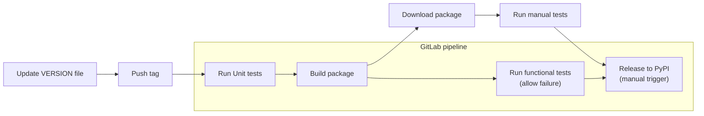

# Development
The repo is maintained by the EGA development team. The client connects to the file-distribution download API which serves the files.

## Update the client
1. Clone the repo in a local workspace
2. Create a feature branch
3. Add changes & tests. To run pyega3 command locally:
    ```bash
    python -m pyega3.pyega3 -t -d fetch <EGAF id> 
    ```
4. Commit and push the changes
5. Update the VERSION file with the new target version
6. Create a PR against master
7. Merge PR
8. Push a tag. The tag must match the version in the VERSION file (there is an internal JIRA ticket EE-2809 filed to ensure this in the future). The tag push will then trigger the GitLab pipeline which will run tests and release to PyPI which is manually trigger at the moment to have more control on when to release.
9. Release to PyPI via manual trigger in GitLab https://gitlab.ebi.ac.uk/EGA/ega-download-client/-/pipelines
10. Verify the new version is published in PyPI https://pypi.org/project/pyega3/
11. Add a release note to describe the changes from last release

## Release a new version to PyPI

The GitLab pipeline pipeline covers running unit tests, functional tests to be run automatically after a commit is tagged for release. It also provides
the ability to download the python package (within a week) for manual testing. Manual testing can test other aspects of the download client like usability and the test cases which can’t be automated.

The test cases covered in functional tests are detailed in the [pyega3 functional test plan](https://docs.google.com/spreadsheets/d/1kMLWBGDrsf3f98DdArOc0HXG-vsvMLJ5MjKk-aJfKGw/edit#gid=0). This document is in a Shared Google drive and only the members of the EGA team have access to it. 

After all testing is done, the team (or the main developer + tester) can decide if the tagged commit is good for release. The build allows the release stage to be manually triggered to proceed with the release to PyPI. There is no need to perform the tests after the release because it is the same package that was tested (automated and manual) and released. This flow ensures that the package is tested and functional before its release.

The functional tests stage also allows failure in case we want to override the process and release even if the functional tests in GitLab are failing. 

